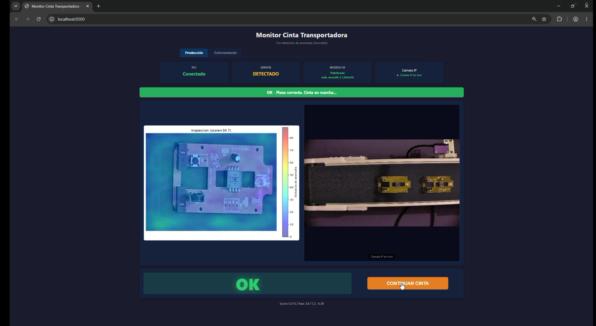
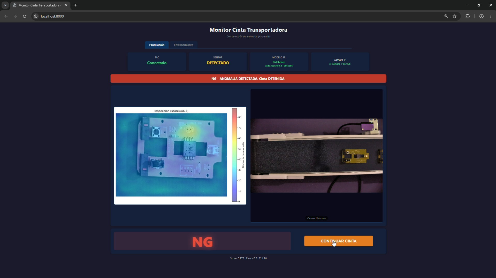

# Conveyor Camera Monitor

> **Presentación del TFM:** [Ver slides online](https://archocron.github.io/TFMBIGschool/slides/tfm_presentation.html)
>
> **Vídeo explicativo del TFM:** [Ver en YouTube](https://www.youtube.com/watch?v=gTCSniSJNbU)

## a. Descripción general del proyecto

**Conveyor Camera Monitor** es un sistema de inspección visual automática para líneas de producción industriales. El proyecto integra hardware industrial (PLC M-Duino 21+), visión por computador (webcam), inteligencia artificial (detección de anomalías con PatchCore) y un backend web para el control y monitorización en tiempo real.

El flujo de trabajo es el siguiente: un sensor fotoeléctrico detecta la llegada de una pieza a la cinta transportadora y ordena la parada inmediata. El PC captura una imagen de alta resolución, la procesa mediante un modelo de IA entrenado para detectar defectos, y decide si la pieza es válida (OK) o defectuosa (NG). Si es OK, la cinta se reanuda automáticamente; si es NG, la cinta permanece parada hasta que un operador revise la pieza y pulse continuar. Todo el proceso se visualiza desde un frontend web accesible en la red local.

Este proyecto ha sido desarrollado como **Trabajo de Fin de Máster (TFM)** del **Máster en Desarrollo con IA** impartido por **BIGschool**, aplicando conocimientos de desarrollo de software, arquitectura de sistemas, inteligencia artificial, calidad de código e integración hardware-software.

> **Asistente de IA utilizado:** El desarrollo, refactorización, testing y documentación de este proyecto han sido potenciados con el asistente de código **Kimi K2.6** (OpenCode), integrado en el flujo de trabajo mediante VS Code y el modelo de IA local.

### Sistema en funcionamiento (modo productivo)

**Pieza OK (completa)** — condensador presente, heatmap en azul (score bajo):



**Pieza NG (condensador eliminado)** — el heatmap en rojo resalta la zona del componente faltante (score alto):



## b. Stack tecnológico utilizado

| Capa | Tecnología | Uso |
|------|-----------|-----|
| **Backend** | Python 3.12 | Lenguaje principal del servidor |
| | FastAPI + Uvicorn | API REST y servidor ASGI |
| | OpenCV (cv2) | Captura de imágenes desde webcam |
| | PyTorch + CUDA 12.4 | Inferencia del modelo de IA en GPU (RTX 4070) |
| | Anomalib (PatchCore) | Framework de detección de anomalías visuales |
| | NumPy, Matplotlib, scikit-learn | Procesamiento numérico, visualización y métricas |
| | Pymodbus | Cliente Modbus TCP para comunicación con PLC |
| | Threading | Gestión de hilos para polling y cooldowns |
| **Frontend** | HTML5 + CSS3 + JavaScript | Interfaz monolítica sin frameworks pesados |
| | WebRTC / H265 | Recepción del stream de la cámara IP en tiempo real |
| **Hardware** | M-Duino 21+ (Industrial Shields) | PLC con Arduino Mega 2560 + Ethernet W5500 |
| | Sensor fotoeléctrico | Detección de piezas en la cinta |
| | Relé de parada | Control de la cinta transportadora |
| | Webcam USB 4MP | Captura de imágenes para inspección |
| | Cámara IP PoE (Hikvision) | CCTV en vivo vía RTSP/WebRTC |
| **Infraestructura** | MediaMTX | Servidor de streaming RTMP/WebRTC |
| | FFmpeg | Puente RTSP → RTMP para la cámara IP |
| | Nginx (Docker) | Proxy web opcional |
| | Docker Compose | Orquestación de contenedores CCTV |
| **Calidad** | pytest + pytest-cov + pytest-mock | Tests unitarios, integración y cobertura |
| | typing (Python) | Type hints en todo el backend |
| | Git | Control de versiones |

## c. Información sobre su instalación y ejecución

### Requisitos previos

- PC con **GPU NVIDIA** (RTX 4070 recomendado) y drivers actualizados.
- **Python 3.12** (PyTorch CUDA 12.4 no dispone de wheels para Python 3.14).
- **Webcam** conectada al PC donde corre el backend.
- **M-Duino 21+** conectado por cable Ethernet directo al PC (adaptador USB-Ethernet).
- **Cámara IP PoE** en la misma red link-local (opcional, para CCTV).

### 1. Clonar o descargar el repositorio

```bash
git clone <url-del-repositorio>
cd TFMBigSchool
```

> Si no usas Git, descomprime el proyecto en `C:\proyectos\TFMBigSchool`.

### 2. Crear el entorno virtual e instalar dependencias

```bash
cd backend
py -3.12 -m venv venv
.\venv\Scripts\python.exe -m pip install -r requirements.txt
.\venv\Scripts\python.exe -m pip install torch torchvision --index-url https://download.pytorch.org/whl/cu124
```

Verifica que la GPU es detectada:
```bash
.\venv\Scripts\python.exe -c "import torch; print(torch.cuda.get_device_name(0))"
```

### 3. Configurar la red del PLC (si es necesario)

La configuración por defecto es:
- **PC:** `169.254.241.143`
- **PLC:** `169.254.241.100` (puerto 502 Modbus TCP)

Si necesitas cambiar la IP del PLC, modifica **ambos** archivos con la **misma IP**:
1. `backend/config.py` → cambia `PLC_HOST`
2. `arduino/conveyor_modbus_tcp/conveyor_modbus_tcp.ino` → cambia `IPAddress ip(...)`

> **Importante:** Después de cambiar el `.ino`, vuelve a subir el sketch al M-Duino.

### 4. Ejecutar el sistema

**Opción A: Script nativo recomendado (Windows)**

Haz doble clic en `start-all.bat` en la raíz del proyecto:
```
[1/4] Iniciando MediaMTX   -> localhost:8889 (WebRTC)
[2/4] Esperando MediaMTX   -> 3s
[3/4] Iniciando FFmpeg     -> RTSP camara IP -> RTMP MediaMTX
[4/4] Iniciando Backend    -> http://localhost:8000
```

Abre el frontend en: **http://localhost:8000**

Para detener todo: `stop-all.bat` o cierra las ventanas.

**Opción B: Manual (desarrollo / debug)**

```bash
# Terminal 1: Servidor de streaming
.\mediamtx.exe cctv\mediamtx.yml

# Terminal 2: Puente RTSP → RTMP
.\tools\ffmpeg.exe -rtsp_transport udp -i rtsp://admin:@169.254.241.135:554/live -c copy -f flv rtmp://localhost:1935/cam

# Terminal 3: Backend FastAPI
cd backend
.\venv\Scripts\python.exe -m uvicorn main:app --host 0.0.0.0 --port 8000
```

**Opción C: Docker Compose (solo infraestructura CCTV + Nginx)**

```bash
docker-compose up -d
```

> **Nota:** Docker Compose solo levanta MediaMTX y Nginx. El backend FastAPI, FFmpeg y Modbus deben ejecutarse nativamente porque necesitan acceso directo a GPU, webcam y red link-local.

## d. Estructura del proyecto

```
TFMBigSchool/
├── backend/
│   ├── main.py                  # API FastAPI + estado de producción
│   ├── modbus_client.py         # Cliente Modbus TCP (polling del PLC)
│   ├── camera.py                # Captura con OpenCV (webcam + thumbnails)
│   ├── config.py                # Configuración centralizada (IP del PLC)
│   ├── find_plc.py              # Script para descubrir la IP del PLC
│   ├── trainer.py               # Modelo PatchCore + calibración + heatmaps
│   ├── requirements.txt         # Dependencias Python
│   ├── pytest.ini               # Configuración de pytest
│   ├── .coveragerc              # Configuración de cobertura
│   ├── tests/                   # Suite de tests automatizados
│   │   ├── test_config.py
│   │   ├── test_camera.py
│   │   ├── test_find_plc.py
│   │   ├── test_modbus_client.py
│   │   ├── test_trainer.py
│   │   └── test_main.py         # 17 tests de integración FastAPI
│   ├── images/                  # Imágenes capturadas (no versionado)
│   ├── training/                # Dataset OK/NG (no versionado)
│   ├── models/                  # Modelos entrenados (no versionado)
│   └── heatmaps/                # Mapas de calor generados (no versionado)
├── frontend/
│   └── index.html               # Frontend monolítico (HTML+CSS+JS vanilla)
├── cctv/
│   ├── mediamtx.yml             # Configuración MediaMTX (WebRTC/RTMP)
│   └── nginx.conf               # Configuración Nginx proxy
├── arduino/
│   └── conveyor_modbus_tcp/
│       └── conveyor_modbus_tcp.ino   # Código M-Duino 21+ (Arduino)
├── tools/
│   └── ffmpeg.exe               # Puente RTSP → RTMP (Windows)
├── mediamtx.exe                 # Servidor streaming nativo (Windows)
├── start-all.bat                # Inicio unificado: backend + CCTV
├── stop-all.bat                 # Detener todos los servicios
├── docker-compose.yml           # Orquestación Docker (CCTV + Nginx)
├── .gitignore                   # Archivos ignorados por Git
├── README.md                    # Documentación principal
└── AGENTS.md                    # Detalles técnicos para desarrolladores
```

## e. Funcionalidades principales

| Funcionalidad | Descripción |
|--------------|-------------|
| **Detección automática de piezas** | Sensor fotoeléctrico conectado al PLC detecta cada pieza y para la cinta. |
| **Captura de imagen 4MP** | Webcam USB captura imagen de alta resolución con precalentamiento y estabilización. |
| **Inferencia IA en GPU** | Modelo PatchCore (Wide ResNet-50 v2) detecta anomalías visuales en ~50-100 ms. |
| **Calibración automática** | Cálculo de umbrales dinámicos con scores OK/NG, AUROC y percentiles (p95/p99). |
| **Mapas de calor (heatmaps)** | Generación automática de overlays sobre la imagen original para identificar zonas defectuosas. |
| **Control de cinta** | Comunicación Modbus TCP para arrancar/parar la cinta desde el backend. |
| **CCTV en vivo** | Stream WebRTC de cámara IP PoE integrado en el frontend (baja latencia). |
| **Entrenamiento interactivo** | Captura y etiquetado de imágenes OK/NG desde el frontend; entrenamiento del modelo en 1-2 minutos. |
| **API REST completa** | Endpoints para status, captura, decisión manual, entrenamiento, predicción y streaming. |
| **Testing automatizado** | 38 tests unitarios e integración con pytest, cobertura de código y mocks. |
| **Control de versiones Git** | Repositorio versionado con `.gitignore` profesional y commits descriptivos. |

## f. Usuario y contraseña de prueba

Este proyecto **no implementa un sistema de autenticación ni login de usuarios**. El acceso al frontend y a la API REST es directo sin credenciales.

- **Frontend:** `http://localhost:8000`
- **API docs (Swagger UI):** `http://localhost:8000/docs`

En caso de requerir autenticación en futuras versiones, se recomienda integrar OAuth2/JWT con FastAPI.

---

## Flujo de producción (diagrama textual)

```
┌─────────────┐     ┌──────────────┐     ┌─────────────┐
│   Sensor    │────▶│  M-Duino 21+ │────▶│   Cinta     │
│  I0.0 (PLC) │     │  (Arduino)   │     │  Q0.0 (RELÉ)│
└─────────────┘     └──────────────┘     └─────────────┘
         │                   │
         │ (coil 0 = 1)      │ (lee coil 1)
         ▼                   ▼
┌─────────────────────────────────────────────────────┐
│              Backend FastAPI (Python)               │
│  ┌──────────┐  ┌──────────┐  ┌──────────────────┐   │
│  │  Modbus  │  │  OpenCV  │  │  PatchCore (GPU) │   │
│  │  Client  │  │  Camera  │  │  Anomalib        │   │
│  └──────────┘  └──────────┘  └──────────────────┘   │
└─────────────────────────────────────────────────────┘
         │
         │ (JSON + imágenes)
         ▼
┌─────────────────────────────────────────────────────┐
│           Frontend (HTML5 + WebRTC)                  │
│  ┌─────────────┐  ┌─────────────┐  ┌─────────────┐  │
│  │  Preview    │  │   Heatmap   │  │   CCTV      │  │
│  │  Webcam     │  │   OK / NG   │  │   En vivo   │  │
│  └─────────────┘  └─────────────┘  └─────────────┘  │
└─────────────────────────────────────────────────────┘
```

## Control de versiones (Git)

Este proyecto está bajo control de versiones con Git.

```bash
# Ver estado
git status

# Ver historial
git log --oneline

# Añadir cambios
git add -A

# Commitear
git commit -m "descripcion del cambio"

# Ver diferencias
git diff
```

**Se versiona:** código fuente, configuración, tests, documentación.  
**Se ignora:** entornos virtuales, imágenes/modelos generados, binarios, logs, certificados, caché Python.

## Testing y calidad de código

El backend incluye una suite completa de tests automatizados.

### Ejecutar tests

```bash
cd backend
.\venv\Scripts\python.exe -m pytest tests/ -v
```

### Ver cobertura

```bash
cd backend
.\venv\Scripts\python.exe -m pytest --cov=. --cov-report=term-missing tests/
```

### Tests disponibles

| Archivo | Tests | Descripción |
|---------|-------|-------------|
| `test_config.py` | 1 | Validación de constantes de red |
| `test_find_plc.py` | 4 | Escaneo de red y conectividad Modbus |
| `test_camera.py` | 5 | Gestión de webcam con mocks de OpenCV |
| `test_modbus_client.py` | 3 | Inicialización, encolado de escrituras, ciclo de vida |
| `test_trainer.py` | 8 | Calibración, guardado de datasets, preparación de datos |
| `test_main.py` | 17 | Tests de integración sobre todos los endpoints FastAPI |
| **Total** | **38** | |

### Estándares aplicados

- **Type hints** en todas las firmas de funciones y clases públicas.
- **Docstrings** descriptivas en módulos, clases y funciones.
- Configuración en `pytest.ini` y `.coveragerc`.

## Conocimientos y capacidades aplicadas

- Desarrollo de software con Python y arquitectura modular desacoplada.
- API REST con FastAPI siguiendo principios de diseño limpio.
- Comunicación entre servicios mediante Modbus TCP y gestión de hilos concurrentes.
- Integración de hardware industrial (PLC/M-Duino) con software de alto nivel.
- Visión por computador con OpenCV y captura de imágenes en tiempo real.
- Inteligencia artificial aplicada a inspección visual: modelo PatchCore con calibración automática.
- Inferencia en GPU con PyTorch y CUDA 12.4.
- Uso de IA generativa y asistentes de código durante el ciclo de desarrollo.
- Testing automatizado con pytest, mocks, cobertura de código y métricas de calidad.
- Type hints y documentación profesional con docstrings descriptivas.
- Contenerización con Docker Compose para servicios de streaming y proxy.
- Redes locales, configuración de interfaces link-local y diagnóstico de conectividad.
- Seguridad en el desarrollo: configuración por entornos, separación de secretos y buenas prácticas.
- Documentación técnica dirigida a equipos de desarrollo y operaciones.

## Dependencias externas no incluidas en Git

Algunos ejecutables y herramientas nativas están **excluidos del repositorio** (`.gitignore`) por ser binarios de terceros o muy pesados. Debes descargarlos manualmente y colocarlos en las rutas indicadas:

| Archivo | Ubicación | Origen / Descarga |
|---------|-----------|-------------------|
| `mediamtx.exe` | Raíz del proyecto | [bluenviron/mediamtx](https://github.com/bluenviron/mediamtx/releases) – Descarga la release para Windows (`mediamtx_vX.Y.Z_windows_amd64.zip`) y extrae el `.exe` en la raíz. |
| `tools/ffmpeg.exe` | `tools/ffmpeg.exe` | [ffmpeg.org](https://ffmpeg.org/download.html) – Versión estática para Windows (`ffmpeg-release-essentials.7z`); copia `ffmpeg.exe` dentro de `tools/`. |

> **Nota:** Docker Compose levanta su propio contenedor de MediaMTX (`bluenviron/mediamtx`), por lo que no necesitas el `.exe` nativo si usas la Opción 2 (Docker). FFmpeg sigue siendo necesario nativamente porque el contenedor Docker no accede a la red link-local de la cámara IP.

## Notas

- Si no tienes PLC conectado, el backend seguirá funcionando y podrás usar **Captura manual** desde la API.
- Si no hay webcam disponible, la captura devolverá `None`.
- En Windows puede ser necesario ajustar el índice de la webcam en `camera.py` (`cv2.VideoCapture(0)`).
- Si el PLC no responde, verifica que el cable Ethernet esté bien conectado y que ambos dispositivos estén en la misma subred.
- La cámara IP PoE debe estar en `169.254.241.135` con puerto RTSP `554` abierto.
- La cámara IP transmite en **H265/HEVC**. El navegador debe soportar H265 en WebRTC.

---

> **TFM - Máster en Desarrollo con IA | BIGschool**  
> Desarrollado con la asistencia de **Kimi K2.6** (OpenCode) para refactorización, testing, documentación y potenciación del flujo de desarrollo.
